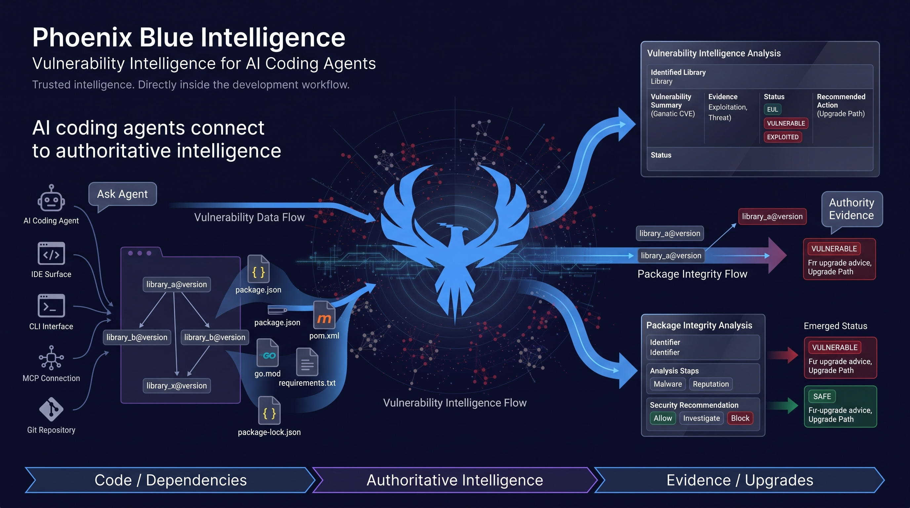

# Phoenix Blue Intelligence — Skills and MCP



Skills and MCP setup that connect **Claude Code** and **Codex** to the
[Phoenix Security](https://phxintel.security) Blue vulnerability intelligence
platform.

Ask your coding agent which libraries in your project are vulnerable, which CVEs
affect the pinned versions, whether your code actually reaches the vulnerable
function, and which version to upgrade to. The answers come from Phoenix and
from your own repository — not from the model's memory.

**Install:** see [docs/INSTALL.md](docs/INSTALL.md). This repository is a
marketplace for both agents.

```
/plugin marketplace add securityphoenix/phoenix-blue-ingelligence-skills     # Claude Code
/plugins marketplace add https://github.com/securityphoenix/phoenix-blue-ingelligence-skills.git   # Codex
```

---

## What is in here

| Part | What it is |
|---|---|
| **MCP server** | 27 intelligence tools, reachable from Claude Code over a stdio bridge |
| **`phoenix-library-upgrade`** | A skill that scans dependencies and returns upgrade targets |
| **`phoenix-cve-intel`** | A skill that interrogates CVE, exploitation, threat-actor, and EOL data |
| **`scripts/check_setup.sh`** | A preflight that tells you exactly which gate is closed |
| **`scripts/reachability.py`** | Local direct/transitive and call-site analysis across 8 ecosystems |
| **Marketplace manifests** | One repo, installable by both Claude Code and Codex |
| **`docs/`** | Install, keys, permissions, setup, and the full field reference |

---

## Quick start

### 1. Get a key

From **My Account -> Platform API Keys** on your Phoenix instance.

You need a **Pro or Enterprise** key: a prefix of `phx_api_power_`,
`phx_api_int_`, or `phx_api_unl_`.

A `phx_gintel_` Global Intel key alone will **not** work. It is a product
licence, not an access scope. See [docs/API_KEYS.md](docs/API_KEYS.md).

### 2. Set your environment

```bash
export PHOENIX_API_KEY="phx_api_power_your_key_here"
export PHOENIX_API_URL="https://phxintel.security"
export PHOENIX_MCP_URL="https://phxintel.security/api/v1/mcp"
```

### 3. Verify before wiring anything

```bash
./scripts/check_setup.sh
```

It checks the host, the key scope, the MCP surface, and the upgrade endpoint. It
names the feature flag behind every failure. Fix what it reports before moving
on.

### 4. Register the MCP server

```bash
cp examples/mcp-manual-setup.json .mcp.json   # manual route only
```

The key is read from your environment. It is never written to the file.
This repository's `.mcp.json` is tracked on purpose — it is the plugin
manifest and holds only `${VAR}` references.

Restart Claude Code. Tools appear as `mcp__phoenix__*`.

### 5. Install the skills

Copy either skill folder into your project or your user skills directory.

```bash
cp -r skills/phoenix-library-upgrade   /path/to/your/project/.claude/skills/
cp -r skills/phoenix-cve-intel         /path/to/your/project/.claude/skills/
```

Then ask in plain language:

> Scan my package-lock.json for vulnerable libraries and tell me what to upgrade.

> Is CVE-2021-23337 exploited in the wild?

---

## How the two surfaces divide the work

Phoenix answers through two channels. They answer different questions, and
mixing them up produces wrong advice.

| Channel | Answers | Transport |
|---|---|---|
| **MCP tools** | Is this package malware? How bad is this CVE? Who exploits it? Is this product past end of life? | JSON-RPC over the stdio bridge |
| **CRA REST endpoint** | Which CVEs affect this exact version, and what do I upgrade to? | `POST /api/v1/intel/library-versions` |

### The trap worth knowing before you start

The firewall MCP tools are a **malware** gate. They are not a CVE scanner.

Measured on the same library, same instance, same minute:

| Call | Result for `lodash@4.17.20` |
|---|---|
| `phoenix_get_package_intel` | `cve_count: 0` |
| `phoenix_check_lockfile` | `0 blocked, 0 warned, 3 allowed` |
| `POST /api/v1/intel/library-versions` | **10 CVEs**, upgrade to `4.18.0` |

Both answers are correct. `lodash` is not malware, so the firewall allows it. It
has ten known CVEs, which is what the CRA endpoint reports.

Use the firewall for "is this package hostile". Use CRA for "is this version
vulnerable". The `phoenix-library-upgrade` skill already does this correctly.

---

## Which key opens which door

Full table in [docs/API_KEYS.md](docs/API_KEYS.md). The short version:

| Prefix | Scope | MCP | CRA upgrade | Tier |
|---|---|---|---|---|
| `phx_api_basic_` | `api_basic` | No | No | Registered |
| `phx_api_power_` | `api_power` | **Yes** | **Yes** | Pro |
| `phx_api_int_` | `api_integration` | **Yes** | **Yes** | Pro |
| `phx_api_unl_` | `api_unlimited` | **Yes** | **Yes** | Enterprise |
| `phx_mcp_` | `mcp` | **Yes** | No | varies |
| `phx_gintel_` | `api_global_intel` | No | No | licence only |
| `phx_pai_` | `pai_internal` | No | No | partner surface |
| `phx_fw_` | `api_firewall` | No | No | firewall CLI |

### Reading a failure correctly

On MCP, a wrong-scope key does **not** get a 403. The server converts it to a
**404** so an unauthorised caller cannot learn that MCP exists.

| Response | Meaning |
|---|---|
| `401 API key required` | You sent no key |
| `401 Invalid or expired API key` | This host does not know the key |
| `404 Not Found` | The key is **valid** but lacks the MCP scope |

Verified live on 2026-09-14: a `phx_gintel_` key returned `404` while a
deliberately bogus key returned `401` on the identical call.

---

## Reachability is measured locally, not by Phoenix

Phoenix tells you a version is vulnerable. It does **not** publish the
vulnerable function name, so it cannot tell you whether your code reaches it.
The `phoenix-library-upgrade` skill measures that in your repository, in four
levels:

| Level | Question | Trust |
|---|---|---|
| L1 | Direct or transitive dependency? | **High** — manifest against lockfile |
| L2 | Is the package imported in first-party code? | **High** when absent |
| L3 | Which of its symbols does the code call? | **Medium** |
| L4 | Does the CVE description name a symbol we call? | **Low — a hint** |

The rule that governs all four:

> **You may lower a priority. You may never clear a finding.**

Static search cannot see dynamic imports, reflection, re-exports, plugin
loaders, or a dependency calling the vulnerable code on your behalf. Many CVEs —
prototype pollution, parser bugs, unsafe defaults — have no call site to find at
all. So the skill is forbidden from writing "not affected", "not vulnerable",
"safe", or "false positive". An actively-exploited CVE stays P1 whatever the
search found.

Full method, per-ecosystem patterns, and the eight blind spots:
[reachability.md](skills/phoenix-library-upgrade/references/reachability.md).

---

## The upgrade answer has a contract

`safe_upgrade_version` is the field that names a version to move to. It has
three possible shapes and a mandatory four-state caveat.

| Shape | Meaning |
|---|---|
| `"4.18.0"` | An advisory names this as the fix |
| `"latest"` | CVEs exist, no advisory names a fix. A **token**, never a version. |
| `null` | No CVEs, or the list was truncated and no answer is safe |

The caveat, `cra_safe_upgrade_corroboration`:

| State | Meaning |
|---|---|
| `corroborated` | Cross-checked against a known release |
| `exceeds_known_latest` | Newer than any release we can see — confirm it exists |
| `no_reference_version` | No release data, so no check ran |
| `no_known_fix` | No advisory names a fix |

On live data, **92%** of components land on `no_reference_version`. That is why
the caveat is four states and not a boolean: "checked and fine" must never read
the same as "never checked".

Full reasoning, with measured numbers:
[upgrade-contract.md](skills/phoenix-library-upgrade/references/upgrade-contract.md).

---

## Feature flags can hide things

The tool list is built per caller from the tier, the key scope, and the server's
feature flags. A missing tool is switched off, not broken.

| Missing | Flag |
|---|---|
| `phoenix_*` firewall tools | `enable_firewall_mcp_server` |
| `intel_get`, `intel_search`, `intel_vocabularies` | `enable_intel_query_surface` |
| `bundles_for_cve`, `get_bundle` | `ENABLE_CVE_BUNDLES` |
| `get_advisory_patches` | `ENABLE_ADV_FETCH` |
| CRA endpoint returns `404` | `enable_cra_intel_surface` |

Flags live on the Phoenix server. Ask your operator. The skills are written to
report a closed gate and stop, never to work around one.

---

## What Phoenix does not tell you

Phoenix emits **evidence**, not a fix verdict.

It does not know whether a vulnerable function is reachable from your code,
whether an upgrade breaks your build, or whether a compensating control already
covers you. Those live in your application graph. Both skills are written to say
so rather than imply a clean bill of health.

An unresolved package is **not** a clean package. It was not assessed.

---

## Documentation

| Document | Covers |
|---|---|
| [docs/INSTALL.md](docs/INSTALL.md) | Marketplace install for Claude Code and Codex, manual install, updating, removal |
| [docs/API_KEYS.md](docs/API_KEYS.md) | Every prefix, every scope, what each unlocks, how to read a failure |
| [docs/MCP_SETUP.md](docs/MCP_SETUP.md) | Bridge setup, endpoints, environment variables, troubleshooting |
| [docs/TOOLS.md](docs/TOOLS.md) | All 27 MCP tools and every CRA response field |
| [upgrade-contract.md](skills/phoenix-library-upgrade/references/upgrade-contract.md) | The `safe_upgrade_version` contract |
| [lockfile-parsing.md](skills/phoenix-library-upgrade/references/lockfile-parsing.md) | Purl extraction for ten ecosystems |

---

## Handling keys safely

- Keys go in environment variables. Never in a committed file.
- `.env` is git-ignored. `.mcp.json` is tracked on purpose: it is the plugin
  manifest and contains only `${VAR}` references, never a value.
- Codex does not expand variables in `~/.codex/config.toml`, so the key is
  literal there. Keep that file at mode `600` and never commit it.
- Keys are shown once at creation.
- Keys are per-environment. A development key returns `401` in production.
- Rotate any key that lands in a chat log, a ticket, or a shared terminal
  transcript.
